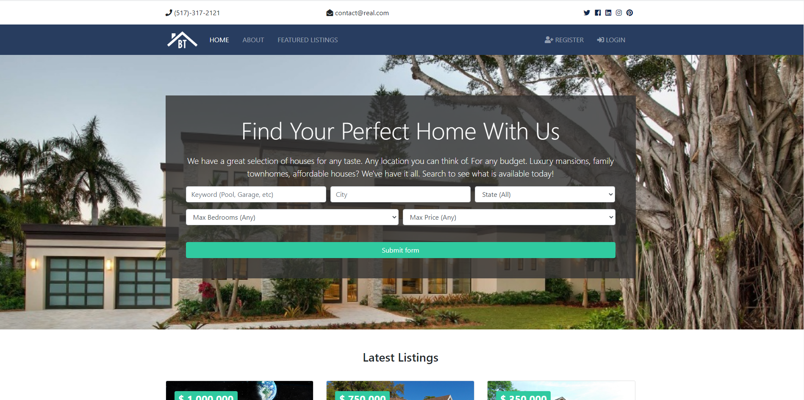
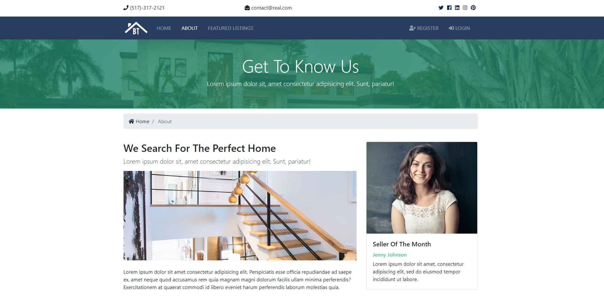
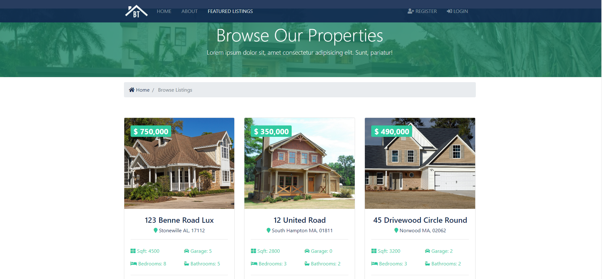
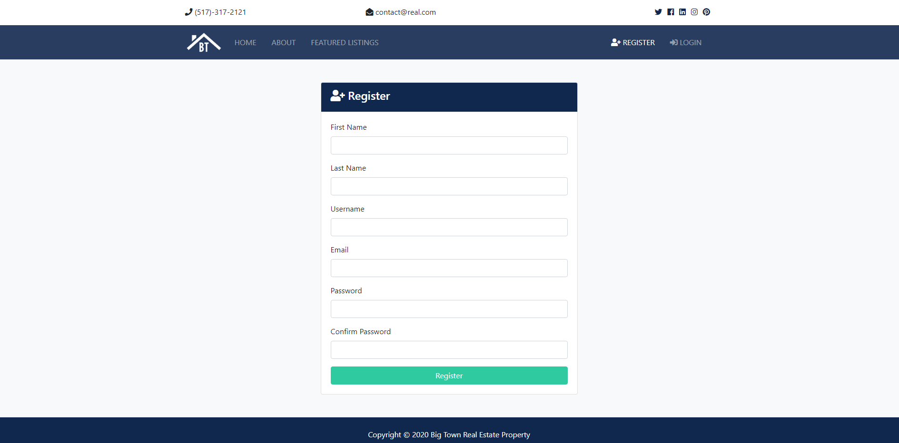
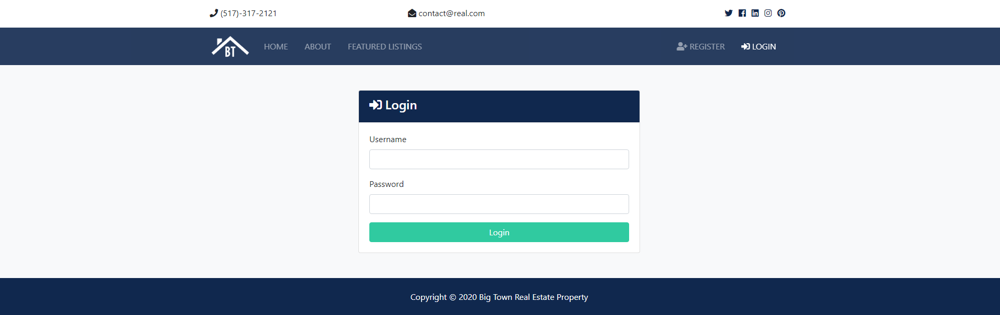

### OVERVIEW:

Real estate website for property listings.

### FUNCTIONALITY:

- Website owner can post listings via Admin with full control over listings
- User can register and log in
- Unauthenticated user can create inquiry using listing inquiry form
- Authenticated user can do the same and have its data pre-populated in form
- Authenticated user cannot make inquiry to the same listing more than once (warning popup)
- Authenticated user can view all completed inquires in User Dashboard


### TECH STACK:
- Bootstrap/CSS/JS - front-end
- Django - back-end, admin
- Postgres - data storage
- Digital Ocean - cloud hosting 
- Gunicorn - WSGI (Web Server Gateway Interface) - communication layer between NGINX and Django
- NGINX - web server (handles static files)

______________
### WEBSITE SCREENSHOTS:







_________

### WEBSITE WORKFLOW:

<ins>Project:
1. **Create project** - django-admin.py startproject real_estate
2. **Add gitignore & readme**

<ins>Pages app:
1. **Create app _pages_** - python manage.py startapp pages
2. **Add _pages_ to real_estate/settings.py INSTALLED_APPS list**
3. **Create pages/urls.py**
4. **Create views in pages/views.py to return index.html & about.html**
5. **Include pages/urls.py to real_estate/urls.py**

<ins>Static files (css, img, js, webfonts):
1. **Create real_estate/static with /css, /img, /js, /webfonts**
2. **Update real_estate/settings.py to add STATIC_ROOT, STATICFILES_DIRS**
3. **Collect static files from multiple apps into a single path for frontend web server (e.g. nginx)** - python manage.py collectstatic

<ins>Templates (website htmls):
1. **Create /templates**
2. **Update real_estate/settings.py TEMPLATES->DIRS to lead to /templates**
3. **Create base.html, pages/index.html & pages/about.html** - base.html contains nav bar, header & footer references, 
index and about - extend base and have only content
4. **Create /partials with _navbar.html, _topbar.html, _footer.html**
5. **Point to static img inside of htmls with  and to correct url page with **

<ins>Listings & Realtors apps:
1. **Create app _listings_** - python manage.py startapp listings
2. **Create app _realtors_** - python manage.py startapp realtors
3. **Add _listings_ and _realtors_ to real_estate/settings.py INSTALLED_APPS list**
4. **Create templates/listings with listings.html, listing.html, search.html** - not for realtors, 
they wouldn't have separate realtors page (will be only as part of existing pages)
5. **Create listings/urls.py** - not for realtors, same reason as above
6. **Include listings/urls.py to real_estate/urls.py**
7. **Create views in listings/views.py to return listings.html, listing.html, search.tml**

<ins>Connect Postgres:
1. **Create new db** - using PGAdmin if exists local server, else install [server+PGAdmin](https://www.postgresql.org/download/) 
2. **Install psycopg2 (Postgres adapter)** - pip install psycopg2, pip install psycopg2-binary
3. **Update real_estate/settings.py DATABASES section**
4. **Run init migration** - python manage.py migrate
5. **Create superuser** - python manage.py createsuperuser

<ins>Create models:
1. **Create listings/models.py with Listing model**
2. **Create realtors/models.py with Realtor model**
3. **Create migrations** - python manage.py makemigrations
4. **Run migrations** - python manage.py migrate

<ins>Admin (+media):
1. **Register Listing in listings/admin.py**
2. **Register Realtor in realtors/admin.py**
3. **Add MEDIA_ROOT & URL to real_estate/settings.py** - all uploads via Admin will be stored in autogenerated /media
4. **Add media to real_estate/urls.py with '+ static...'** - to display media files on UI later
5. **Create realtors and listings entries in Admin**
6. **Create css/admin.py to style admin in brand colors**
7. **Customize admin listings view by adding class in listings/admin.py with admin fields to display, filter etc.**
8. **Customize admin realtors view by adding class in realtors/admin.py with admin fields to display, filter etc.**

<ins>Pull DB data into listings html:
1. **Request data in listings/views.py with Django ORM and pass context to listings.html**
2. **For listings.html loop through listings parameter and return listing.title, listing.price etc.** - html return 
dynamic data instead of hardcoded values
3. **Add humanize to real_estate/settings.py**
4. **Load humanize into listings.html and use it for formatting (20000 to 20`000 etc.)**

<ins>Add pagination:
1. **Add paginator to listings/views.py**
2. **Update listings.html to display previous/current/available/next pages**

<ins>Pull DB data into rest of the htmls (home, about, listing, search):
1. **Request data in listings/views.py with Django ORM and pass context to htmls**
2. **Loop through listings and realtors for templates**
3. **Move listings section into /partials and update index, listings and search.html** - to avoid html repetition in templates

<ins>Search:
1. **Create choices.py in /listings with list/dictionary options**
2. **Pass choices to pages/views.py (index) and listings/views.py (search)**
3. **Update index.html and search.html to work with choices**
4. **Move search form section into /partials and update index and search.html** - to avoid html repetition in templates
5. **Update listings/views.py to filter queryset according to search params**
6. **Update partials/_search_form.html to keep search params on UI after the run**

<ins>Accounts app:
1. **Create accounts app** - python manage.py startapp accounts
2. **Add _accounts_ to real_estate/settings.py INSTALLED_APPS list**
3. **Create accounts/urls.py**
4. **Create views in accounts/views.py linked to urls**
5. **Include accounts/urls.py to real_estate/urls.py**
6. **Create templates/accounts with register.html, login.html, dashboard.html**

<ins>Message alerts:
1. **Add MESSAGE_TAGS to real_estate/settings.py**
2. **Create partials/_alerts.html**
3. **Include _alerts.html to login.html & register.html**

<ins>Registration, Login & Logout:
1. **Update _registration_ method in accounts/views.py to validate & save user**
2. **Update _login_ method in accounts/views.py to login user**
3. **Update _logout_ method in accounts/views.py to logout user**
4. **Update relative templates**
5. **Add dynamic title to all template pages** - to display smth like 'Website | Welcome' in browse tab

<ins>Contacts app:
1. **Create app _contacts_** - python manage.py startapp contacts
2. **Add _contacts_ to real_estate/settings.py INSTALLED_APPS list**
3. **Create contacts/urls.py**
4. **Add contacts to real_estate/urls.py**
5. **Create contacts/models.py with Contact model**
6. **Create migrations** - python manage.py makemigrations contacts
7. **Run migrations** - python manage.py migrate contacts
8. **Add contacts to contacts/admin.py**
9. **Update listing.html to pre-populate fields for logged in users, include alerts**
9. **Create contact view in contacts.views.py to save form data** - with additional logic (send email to realtor, detect if form was already submitted)
10. **Update real_estate/settings.py with email config**
11. **Update dashboard in accounts/views.py and accounts/dashboard/html to work with db data** 

______________

### DEPLOYMENT WITH DIGITAL OCEAN 
(see [steps from course](https://gist.github.com/bradtraversy/cfa565b879ff1458dba08f423cb01d71) or [steps from DO](https://www.digitalocean.com/community/tutorials/how-to-set-up-django-with-postgres-nginx-and-gunicorn-on-ubuntu-18-04#testing-socket-activation))

<ins>Create SSH key with Putty:
1. **Download [Putty and puttygen](https://www.chiark.greenend.org.uk/~sgtatham/putty/latest.html)**
2. **Use Puttygen to create private-public pair**

<ins>Create SSH key with Bash (if later decided to use Putty, need to convert private key into .ppk format):
1. **Create ssh key** - ssh-keygen -> enter path like /c/Users/.../.ssh/id_rsa_digitalocean (Git Bush on Wind10)
2. **Get public ssh key** - cat ./.ssh/id_rsa_digitalocean.pub -> copy
3. **Convert SSH private key generated by bash in Putty .ppk format (if used Putty)** - Open Puttygen -> Load private key -> Copy -> Save private key using .ppk extension

<ins>Create droplet with SSH (use any key - from Putty or Bash):
1. **Enter PUBLIC ssh key into Digital Ocean Settings/Security** 
2. **Goto [Digital Ocean](https://www.digitalocean.com/) and select ssh during droplet creation OR insert new key here directly**

<ins>Connect to server 
(use Putty option):
1. **Setup Putty to connect to server via local machine (use PRIVATE ssh)** - use [instructions](https://www.digitalocean.com/docs/droplets/how-to/connect-with-ssh/putty/)
2. **Other way - Connect to server console directly via Digital Ocean** - better not to use, BAD console ([capslock](https://www.digitalocean.com/community/questions/console-stuck-in-caps-lock-mode), [slash](https://www.digitalocean.com/community/questions/why-can-not-be-written-on-browser-s-console), lagging)
3. **Other way - Connect via local machine using Git Bush** - worse than Putty in usability - ssh root@111.11.111.11**  (if refused -> ssh-add ./.ssh/id_rsa_digitalocean -> || if could not open connection -> eval ssh-agent -s ("ssh-agent -s" in ``) and repeat ssh-add command)

<ins>Create new user 
(security provisions):
1. **Create new user** - adduser djangoadmin_v
2. **Give new user admin privileges** - usermod -aG sudo djangoadmin_v
3. **Open user folder and create .ssh folder** - cd /home/djangoadmin_v -> mkdir .ssh -> cd .ssh
4. **Create authorized keys with ssh key** - nano authorized_keys (paste key -> Ctrl+X -> Y to save -> Enter to exit) -> cat authorized_keys (to view key)
5. **Log in as new user**
6. **Disable root login** - nano /etc/ssh/sshd_config -> PermitRootLogin no ; PasswordAuthetincation no
7. **Reaload sshd service** - sudo systemctl reload sshd

<ins>Setup Firewall:
1. **See which apps are registered with the firewall** - sudo ufw app list
2. **Allow OpenSSH** - sudo ufw allow OpenSSH
3. **Enable firewall** - sudo ufw enable 
4. **Check status** - sudo ufw status

<ins>Install software:
1. **Update packages** - sudo apt update -> sudo apt upgrade
2. **Install python packages** - sudo apt install python3-pip python3-dev libpq-dev postgresql postgresql-contrib nginx curl

<ins>Create POSTGRES DB and Admin:
1. **Create postgres DB & ADMIN** - sudo -u postgres psql -> (entered pg shell) CREATE DATABASE real_estate_prod; -> CREATE USER dbadmin WITH PASSWORD '123';
2. **Setup admin role** - ALTER ROLE dbadmin SET client_encoding TO 'utf8'; -> ALTER ROLE dbadmin SET default_transaction_isolation TO 'read committed'; -> ALTER ROLE dbadmin SET timezone TO 'UTC';
3. **Grant all privileges to admin** - GRANT ALL PRIVILEGES ON DATABASE real_estate_prod TO dbadmin; -> \q (exit pg shell)

<ins>Create Virtual Environment:
1. **Install the python3-venv package** - sudo apt install python3-venv
2. **Create project directory** - mkdir pyapps -> cd pyapps
3. **Create venv & activate** - python3 -m venv ./venv -> source venv/bin/activate

<ins>Clone project from GIT:
1. **Clone Git project** - git clone https://github.com/valievav/Real_estate_project.git (git pull if updated github after cloning)
2. **Install pip modules from requirements** - cd Real_estate_project -> pip install -r requirements.txt -> pip freeze (to check libs installed)

<ins>Setup local settings (security provisions - NEVER use private key from Public repo):
1. **Add code to project settings.py to upload local_settings.py if exist -> push to GitHub**
```
try:
    from .local_settings import *
except ImportError:
    pass 
```
2. **Pull GitHub changes to server** - git pull
3. **Create local_settings.py alongside settings.py on server** - cd real_estate/real_estate -> sudo nano local_settings.py 
```
SECRET_KEY = '****edit -m*2dqejb!1am!lvs&x*9)x8yu%^#snf2r8mnyh3l-_%ljirxb'

ALLOWED_HOSTS = ['****droplet ip']

DEBUG = False

DATABASES = {
    'default': {
        'ENGINE': 'django.db.backends.postgresql',
        'NAME': 'real_estate_prod',
        'USER': 'dbadmin',
        'PASSWORD': '***',
        'HOST': 'localhost',  # same server
    }
}

# Email config
EMAIL_HOST = 'smtp.gmail.com'
EMAIL_PORT = 587
EMAIL_HOST_USER = '****@gmail.com'
EMAIL_HOST_PASSWORD = '****'  # app password https://support.google.com/accounts/answer/185833#app-passwords
EMAIL_USE_TLS = True
```
-> Ctrl+X -> y (save) -> Enter (exit) -> cat local_settings.py (to see file)

<ins>Setup project (migrations, static files, open port) & run:
1. **Run makemigrations** - cd .. -> python manage.py makemigrations (no changes detected)
2. **Run migrate** - python manage.py migrate
2. **Create super user for Django admin** - python manage.py createsuperuser
3. **Collect static files into 1 folder** - python manage.py collectstatic
4. **Create Firewall exception for port 8000** - sudo ufw allow 8000
5. **Run server** - python manage.py runserver 0.0.0.0:8000 (will be displayed raw html w/o css etc. because DEBUG=False, want to see full view - change to True (Ngnix will handle correct view with DEBUG=False later))

<ins>Setup Gunicorn (Python WSGI HTTP Server for UNIX - used to run server w/o having console opened):
1. **Install gunicorn on server** - pip install gunicorn
2. **Add gunicorn to requirements.txt on server** - pip freeze > requirements.txt
3. **Test gunicorn serve** - gunicorn --bind 0.0.0.0:8000 real_estate.wsgi (simple html w/o img etc.)
4. **Stop server & deactivate Virtual Env** - Ctrl+C -> deactivate (exit virtual env)
5. **Create gunicorn.socket file** - sudo nano /etc/systemd/system/gunicorn.socket
```
[Unit]
Description=gunicorn socket

[Socket]
ListenStream=/run/gunicorn.sock

[Install]
WantedBy=sockets.target
```
6. **Create gunicorn.service file** - sudo nano /etc/systemd/system/gunicorn.service
```
[Unit]
Description=gunicorn daemon
Requires=gunicorn.socket
After=network.target

[Service]
User=djangoadmin
Group=www-data
WorkingDirectory=/home/djangoadmin/pyapps/Real_estate_project/real_estate
ExecStart=/home/djangoadmin/pyapps/venv/bin/gunicorn \
          --access-logfile - \
          --workers 3 \
          --bind unix:/run/gunicorn.sock \
          real_estate.wsgi:application

[Install]
WantedBy=multi-user.target
```
7. **Start and enable gunicorn socket** - sudo systemctl start gunicorn.socket -> sudo systemctl enable gunicorn.socket (systemctl start gunicorn.socket - if need to reload)
8. **Check status of guinicorn** - sudo systemctl status gunicorn.socket (should be active, listening)
9. **Check the existence of gunicorn.sock** - file /run/gunicorn.sock (make sure exists)

<ins>Setup NGINX:
1. **Create Real_estate_project file** - sudo nano /etc/nginx/sites-available/Real_estate_project
```
server {
    listen 80;
    server_name YOUR_IP_ADDRESS;

    location = /favicon.ico { access_log off; log_not_found off; }
    location /static/ {
        root /home/djangoadmin/pyapps/Real_estate_project/real_estate;
    }
    
    location /media/ {
        root /home/djangoadmin/pyapps/Real_estate_project/real_estate; 
    }

    location / {
        include proxy_params;
        proxy_pass http://unix:/run/gunicorn.sock;
    }
}
```
2. **Enable the file by linking to the sites-enabled dir** - sudo ln -s /etc/nginx/sites-available/Real_estate_project /etc/nginx/sites-enabled
3. **Test NGINX config** - sudo nginx -t (check that config is OK)
4. **Restart NGINX** - sudo systemctl restart nginx
5. **Remove port 8000 from firewall & open it up on port 80** - sudo ufw delete allow 8000 -> sudo ufw allow 'Nginx Full'
6. **Increase the max upload size in nginx conf** - sudo nano /etc/nginx/nginx.conf -> under http section add - client_max_body_size 20M;
7. **Restart NGINX** - sudo systemctl restart nginx
8. **GOTO ip (w/o port, it's automatically running on 80)** - website up and running :) YEY!
9. **If issues** - (check nginx running) systemctl status nginx -> (check issue) sudo tail -30 /var/log/nginx/error.log 

<ins>On repo update:
1. **GOTO repo location** - cd /home/djangoadmin/pyapps/Real_estate_project
2. **Pull changes** - git pull
3. **Restart NGINX & Gunicorn** -  sudo systemctl restart nginx -> sudo systemctl restart gunicorn
4. **Clear browser cache**
5. **If issues** - cd /home/djangoadmin/pyapps -> source venv/bin/activate -> cd Real_estate_project/real_estate -> ACTION -> deactivate -> Restart NGINX & Gunicorn, 
where ACTION - regenerate static folder (python manage.py collectstatic)/ run migrations etc.

---
###  API

<ins>Create API endpoints:
1. **Create new api app** - python manage.py startapp api
2. **Install DRF (djangorestframework)** - pip install djangorestframework
3. **Add DRF to requirements.txt**
4. **Add rest_framework & api app to the real_estate/settings.py INSTALLED_APPS**
5. **Include api/urls.py to real_estate/urls.py**
6. **Create api/urls.py**
7. **Create serializer.py**
8. **Create views in api/view.py**
9. **Enable pagination - add REST_FRAMEWORK section to real_estate/settings.py with DEFAULT_PAGINATION_CLASS**
10. **Use website login/logout functionality to test API** - need to have api-auth/ in api/urls.py for that
11. **Repeat steps urls + serializers + views to prepare other API calls)**

